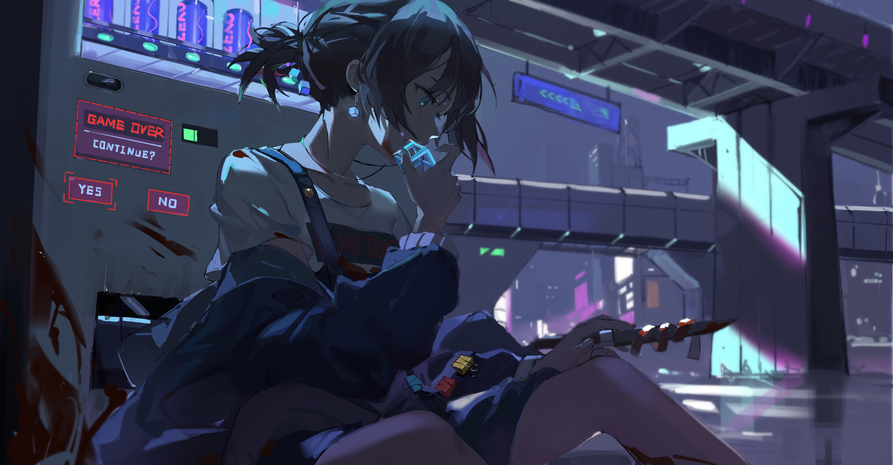
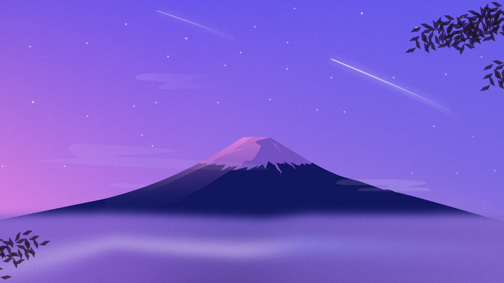

# Omarchy Flat Dracula Theme

Flat take on the Dracula palette for a Hyprland-based Wayland setup and common CLI tools. Includes matching wallpapers (`backgrounds/`) and a preview (`preview.png`).

This exists because I wanted an authentic Dracula experience on Omarchy: other attempts felt off-spec or busy, so I built a version that stays true to the palette while keeping distractions low. The goal is to make it easy to lock in for long sessions—high contrast where it matters, soft edges where it does not, and readability that stays gentle on the eyes.


## What’s included
- Hyprland: dimmed inactive windows, zero borders, custom opacity rules (`hyprland.conf`)
- Hyprlock colors for ring and text (`hyprlock.conf`)
- Waybar styling with Iosevka and translucent bar (`waybar.css`)
- Terminals: Alacritty (`alacritty.toml`) and Ghostty (`ghostty.conf`)
- Shell/UI tools: Starship prompt (`starship.toml`), btop (`btop.theme`), Lazygit (`lazygit.yml`)
- Notifications and helpers: Mako (`mako.ini`), SwayOSD (`swayosd.css`), Walker launcher (`walker.css`)
- Neovim Dracula plugin + LazyVim colorscheme snippet (`neovim.lua`)
- Icon theme pointer for Yaru-purple (`icons.theme`)

## Quick start
Run the installer and it will place everything where it belongs:

```bash
omarchy-theme-install https://github.com/OldJobobo/omarchy-flat-dracula-theme
```

Starship is optional—if you want this prompt, back up your existing file and replace it:

```bash
mv ~/.config/starship.toml ~/.config/starship.toml.bak
cp starship.toml ~/.config/starship.toml
```

Wallpapers live in `backgrounds/`; `preview.png` shows the intended look.

## Background previews
<table>
  <tr>
    <td align="center" valign="top"><br><sub>arch-bats-moon.png</sub></td>
    <td align="center" valign="top"><br><sub>bats-moon-ring.png</sub></td>
    <td align="center" valign="top"><br><sub>bike-night-sky.jpg</sub></td>
    <td align="center" valign="top"><br><sub>blue-particle-wave.jpg</sub></td>
  </tr>
  <tr>
    <td align="center" valign="top"><br><sub>cadillac-lounge-neon.jpg</sub></td>
    <td align="center" valign="top"><br><sub>cute-dracula.png</sub></td>
    <td align="center" valign="top"><br><sub>cute-ghost.png</sub></td>
    <td align="center" valign="top"><br><sub>cyberpunk-vending.jpg</sub></td>
  </tr>
  <tr>
    <td align="center" valign="top"><br><sub>firewatch-tower-night.png</sub></td>
    <td align="center" valign="top"><br><sub>holo-giant-pointer.jpg</sub></td>
    <td align="center" valign="top"><br><sub>howling-wolf-cliff.jpg</sub></td>
    <td align="center" valign="top"><br><sub>kraken-tentacles.png</sub></td>
  </tr>
  <tr>
    <td align="center" valign="top"><br><sub>late-night-horror.jpg</sub></td>
    <td align="center" valign="top"><br><sub>minimal-bats-moon.jpg</sub></td>
    <td align="center" valign="top"><br><sub>neon-fluid-waves.png</sub></td>
    <td align="center" valign="top"><br><sub>neon-portrait-profile.jpg</sub></td>
  </tr>
  <tr>
    <td align="center" valign="top"><br><sub>pastel-mt-fuji.jpg</sub></td>
    <td align="center" valign="top"><br><sub>pastel-tree.png</sub></td>
    <td align="center" valign="top"><br><sub>purple-waves.png</sub></td>
    <td align="center" valign="top"><br><sub>sunrise-ray-clouds.jpg</sub></td>
  </tr>
  <tr>
    <td align="center" valign="top"><br><sub>zombie-hand.png</sub></td>
  </tr>
</table>

## Notes
- Hyprland rules enforce full opacity on active windows and slight dimming on inactive ones; adjust `windowrule` lines if you want different defaults.
- The palette follows https://spec.draculatheme.com across all configs for consistency.
